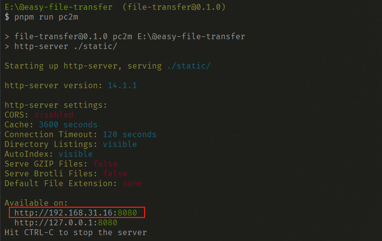
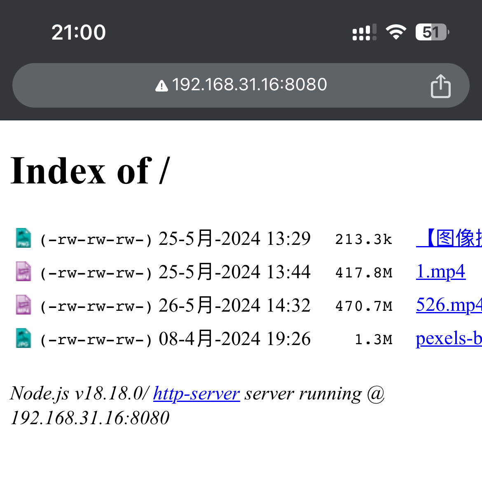
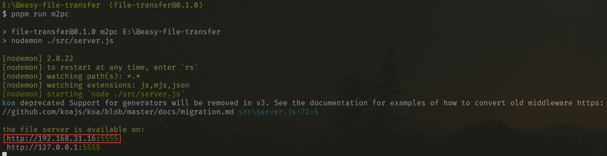
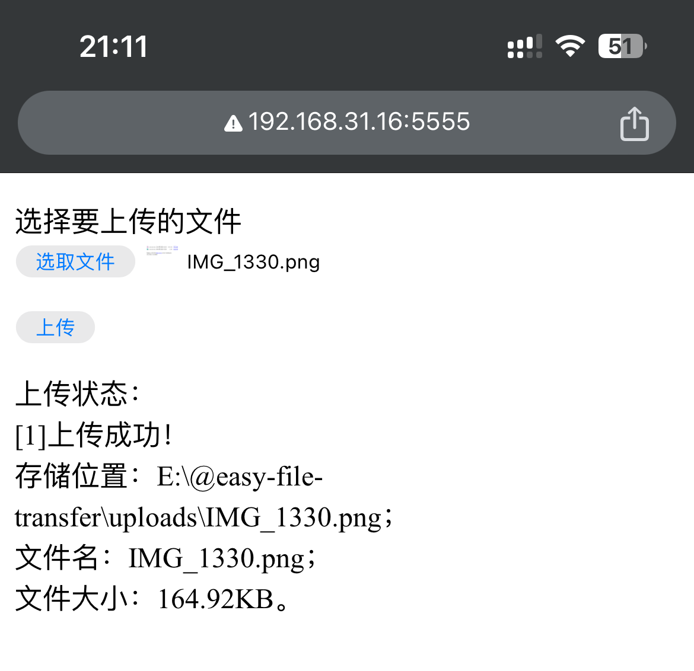

# Easy-File-Transfer

> 使用前提：pc 端和移动端在同一个局域网下！

一个用来在 pc 端和移动端之间**极速传输**文件的工具。

## 依赖安装

通过以下命令安装依赖：

```bash
$ pnpm install
```


## pc 端 -> 移动端

将需要传输的文件放到 `static` 文件夹下，然后在项目根目录下输入以下命令：

```bash
$ pnpm run pc2m
```

之后，移动端浏览器访问 `http-server` 启动的服务，一般选择第一个：




然后在页面中点击要传输的文件，即可将文件下载到移动端本地：




## 移动端 -> pc 端

项目根目录下输入以下命令启动上传页面入口：

```bash
$ pnpm run m2pc
```



通过启动服务的 url 访问可以看到：


然后通过 file 表单项选择文件并上传（支持多选），上传成功的文件会放在 `uploads` 文件夹中：




## pc端 <-> 移动端

如果想同时启动双向传输通道，在项目根目录下输入以下命令即可：

```bash
$ pnpm run bootstrap
```

此时控制台会看到：


